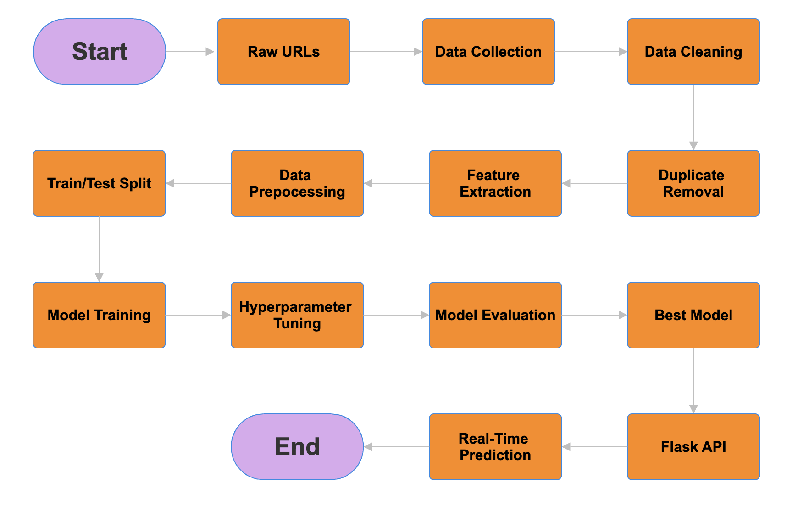
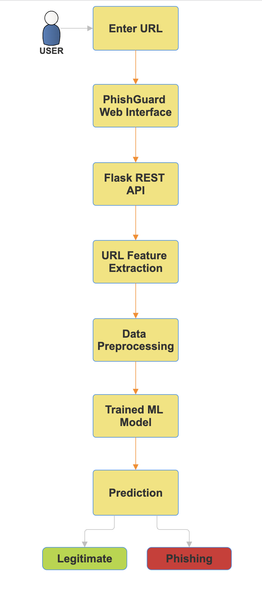

# 🛡️ PhishGuard

  
  
  
  

  <strong>🔐 Machine Learning Based Phishing URL Detection System</strong>

  Detect potentially malicious URLs using machine learning and real-time analysis.

---

## 🌐 Live Website

🚀 **PhishGuard:**  
https://phishguard.in

---

## 📖 About The Project

**PhishGuard** is a machine-learning-based phishing URL detection system designed to identify whether a given URL is **legitimate** or potentially **phishing**.

The system analyzes the structure and characteristics of a URL, extracts relevant features, and uses a trained machine learning model to generate a prediction.

PhishGuard combines:

- 🤖 Machine Learning
- 🔎 URL Feature Extraction
- 🐍 Python
- 🌶️ Flask REST API
- 🌐 Web Application
- 🗄️ Database Integration
- 🧩 Browser Extension
- ☁️ Cloud Deployment

The primary objective of the project is to provide users with a simple way to analyze suspicious URLs before visiting them.

---

# ✨ Key Features

### 🔎 Real-Time URL Detection

Users can enter a URL and receive a prediction through the PhishGuard web application.

### 🤖 Machine Learning Classification

Multiple machine learning algorithms were trained and evaluated to identify phishing URLs.

### 🧠 URL Feature Extraction

The system extracts important characteristics from URLs, including:

- URL length
- Number of subdomains
- Number of special characters
- HTTPS usage
- Presence of phishing-related keywords

### 📊 Multiple Model Comparison

The project evaluates multiple classification algorithms:

- Random Forest
- Gradient Boosting
- Logistic Regression
- Decision Tree

### ⚙️ Hyperparameter Tuning

Model parameters are optimized using machine learning techniques such as:

- GridSearchCV
- StratifiedKFold

### 🌐 REST API

The trained model is integrated with a Flask REST API to provide real-time predictions.

### 🧩 Browser Extension

A browser extension was developed to allow URL analysis directly from the browser.

### 📱 Responsive Web Interface

The frontend is designed to provide a clean and responsive experience across desktop and mobile devices.

---

# 🏗️ Machine Learning Pipeline

The PhishGuard system follows an end-to-end machine learning workflow, from URL collection to real-time prediction.

  

### Pipeline Stages

| Stage | Description |
|---|---|
| **Raw URLs** | Initial collection of URL records |
| **Data Collection** | Gathering phishing and legitimate URLs |
| **Data Cleaning** | Cleaning and validating collected data |
| **Duplicate Removal** | Removing duplicate URL records |
| **Feature Extraction** | Extracting meaningful URL characteristics |
| **Data Preprocessing** | Preparing features for machine learning |
| **Train/Test Split** | Dividing data into training and testing sets |
| **Model Training** | Training multiple classification models |
| **Hyperparameter Tuning** | Optimizing model parameters |
| **Model Evaluation** | Evaluating and comparing trained models |
| **Best Model** | Selecting the best-performing model |
| **Flask API** | Exposing the trained model through an API |
| **Real-Time Prediction** | Predicting whether submitted URLs are phishing or legitimate |

---

# 📊 Dataset

PhishGuard was developed using a large dataset containing both **phishing** and **legitimate URLs**.

The dataset went through multiple stages of processing, including:

- Data collection
- URL validation
- Data cleaning
- Duplicate removal
- Feature extraction
- Data preprocessing
- Dataset splitting
- Model training and evaluation

The project worked with **800K+ URL records** during the dataset and feature-engineering process.

### Classification Labels

| Label | Class |
|---:|---|
| `0` | Legitimate |
| `1` | Phishing |

---

# 🔬 Features Used

The machine learning model uses URL-based features to identify suspicious patterns.

| Feature | Description |
|---|---|
| `url_length` | Total length of the URL |
| `num_subdomains` | Number of subdomains in the URL |
| `num_special_chars` | Number of special characters |
| `is_https` | Indicates whether HTTPS is used |
| `has_phishing_keyword` | Indicates the presence of phishing-related keywords |

These features are processed before being passed to the trained classification model.

---

# 🤖 Machine Learning Models

Several supervised machine learning algorithms were evaluated.

## 🌲 Random Forest

Random Forest achieved the following reported results:

| Metric | Score |
|---|---:|
| Accuracy | **80.04%** |
| ROC-AUC | **87.40%** |
| Average Precision | **85.50%** |
| F1 Score | **81.54%** |

## 📈 Gradient Boosting

Gradient Boosting achieved:

| Metric | Score |
|---|---:|
| Accuracy | **79.72%** |
| ROC-AUC | **86.82%** |
| Average Precision | **84.73%** |
| F1 Score | **81.59%** |

### Other Models Evaluated

- Logistic Regression
- Decision Tree

The models were compared using multiple evaluation metrics rather than relying only on accuracy.

---

## 🔄 How the System Works

The complete prediction workflow can be summarized as:

  

